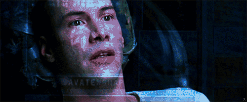

<h2 align="left">Hi! my name is Oseas Andre</h2>

###

<table border="0">
  <tr><td></td><td></td></tr>
</table>

###

  I am on my way to becoming an Algorithm Engineer,  
  driven by a strong passion for Software Development and Algorithm Design. 
  With hands-on experience as a Backend Developer,  
  I have been contributing to the development of scalable and efficient APIs using Java and Spring Boot. 
  Combining fundamental computer science learning and pratice, with contributions to real-world industrial software development.

  
###

  
  
  
  
  
  
  
  
  

###
###

